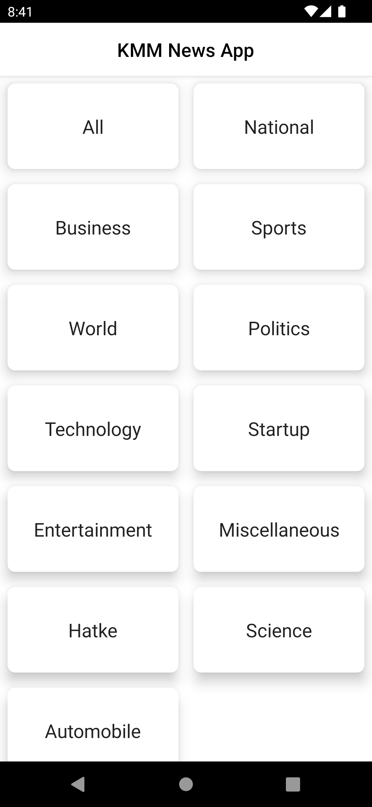
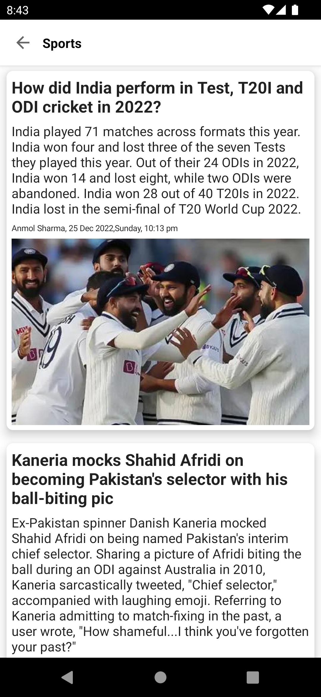
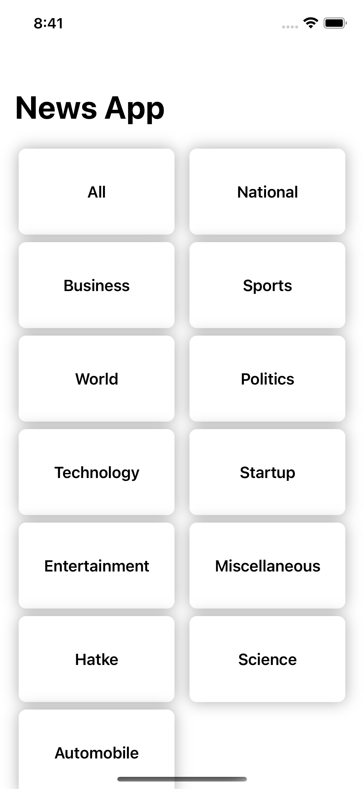
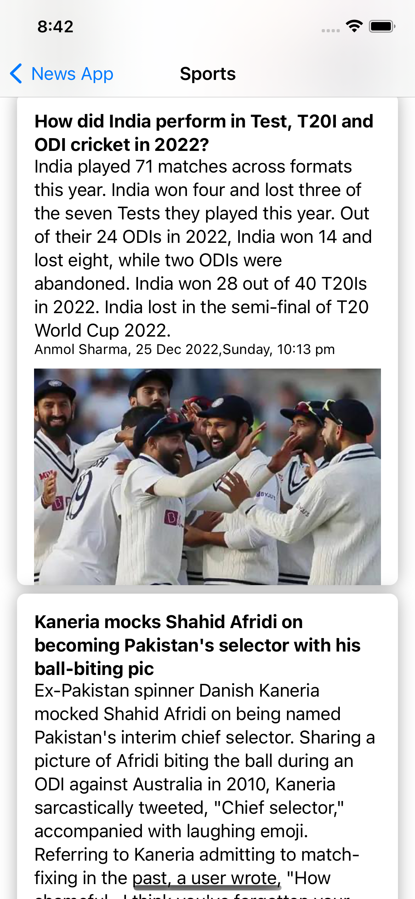

# KMP News App

### Project Description

A simple app that I created with **Kotlin Multiplatform Mobile**.

### InShort API

I used [Unofficial InShorts News API](https://github.com/cyberboysumanjay/Inshorts-News-API) to get
the news shown in the apps.

Tech Stack:

- Compose for Android UI
- SwiftUI for iOS UI
- MVVM
- Kotlin Coroutines
- Ktor for api calls
- Koin for dependency injection
- Room for caching
- and more...

# Screenshots

## Android

|                                               |                                               |
|:---------------------------------------------:|:---------------------------------------------:|
|  |  |

## iOS

|                                            |                                            |
|:------------------------------------------:|:------------------------------------------:|
|  |  |

## CONTACT

- [Linkedin](https://www.linkedin.com/in/muaz-kadan-727911107/)

```xml
Designed and developed by Muaz KADAN

Licensed under the Apache License, Version 2.0 (the "License");
you may not use this file except in compliance with the License.
You may obtain a copy of the License at

   http://www.apache.org/licenses/LICENSE-2.0

Unless required by applicable law or agreed to in writing, software
distributed under the License is distributed on an "AS IS" BASIS,
WITHOUT WARRANTIES OR CONDITIONS OF ANY KIND, either express or implied.
See the License for the specific language governing permissions and
limitations under the License.
